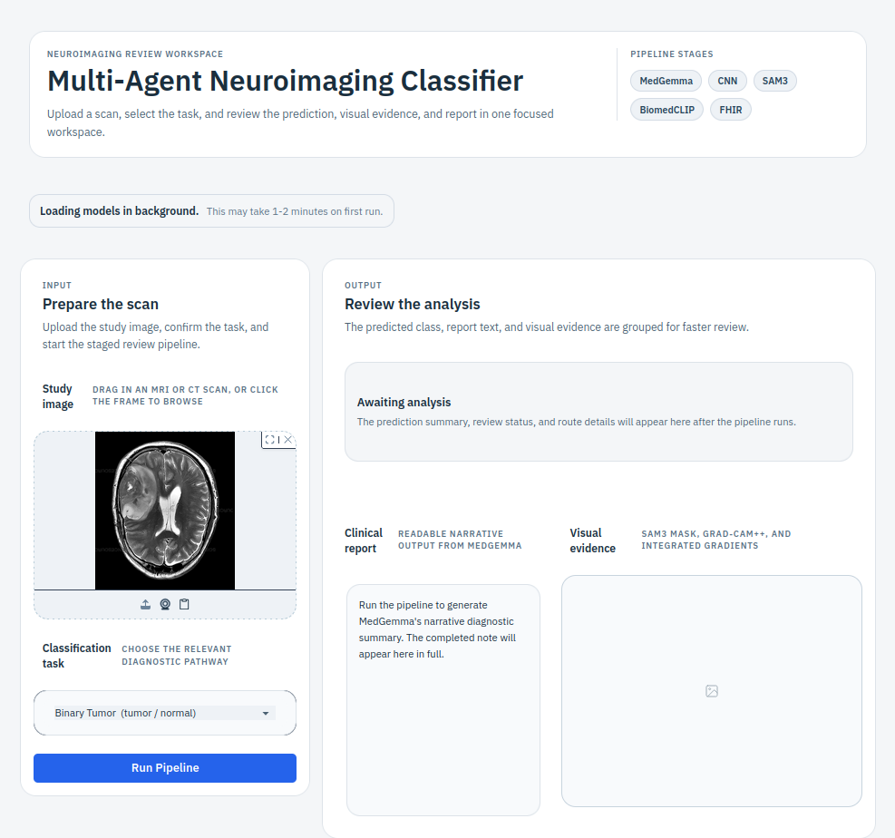

# Multi-Agent Neuroimaging Classifier

A LangGraph-based multi-agent pipeline for automated classification of neuroimaging findings (brain tumour, multiple sclerosis, stroke).

## Contents

- [Quick Start](#quick-start-gui)
- [Architecture](#architecture)
- [Tasks](#tasks)
- [Setup](#setup)
- [Checkpoints](#checkpoints)
- [Usage](#usage)
- [Report Output](#report-output)
- [Explainability Methods](#explainability-methods)
- [Calibration](#calibration)
- [Prior Work](#prior-work)
- [Project Structure](#project-structure)

## Quick Start (GUI)

```bash
python -m venv .venv
source .venv/bin/activate
pip install -r requirements.txt

# Set your HuggingFace token (see Setup below)
cp .env.example .env
# edit .env and paste your HF_TOKEN

# Launch the web interface
python app.py
# Open http://localhost:7860 in a browser
```

Upload a brain scan, choose a task, click **Run Pipeline** — the full agent pipeline runs and
displays the prediction, clinical report, segmentation overlay, and saliency maps.



## Architecture


**Agents / tools**

| Component | Model | Role |
|---|---|---|
| `MedGemmaAgent` | google/medgemma-1.5-4b-it | Triage, bbox-guided diagnosis, verification, final report |
| `CNNClassifier` | VGG16 / DenseNet169 / ResNet101 | Task-specific classification |
| `SAM3Tool` | SAM3 frozen backbone + linear probe | Lesion segmentation (Dice = 0.836) |
| `BiomedCLIPTool` | microsoft/BiomedCLIP (ViT-B/16, layer 6) | Linear probe classifier; falls back to zero-shot when no probe checkpoint is available |

**Pipeline flow** (linear — every node runs for every image):

```
triage (MedGemma)
    → cnn_classify
    → sam3_segment
    → cnn_with_mask  (CNN on original + MedGemma on SAM3 overlay)
    → biomedclip
    → explainability  (Grad-CAM++ + Integrated Gradients)
    → verification    (MedGemma checks CNN vs saliency map)
    → report          (MedGemma fuses all outputs)
    → fhir_output
```

SAM3 runs only for `binary_tumor` and `multiclass_tumor` — the linear probe was trained on BraTS 2020 and evaluated on BraTS 2021; MS/stroke probes performed poorly, so those tasks skip segmentation automatically. BiomedCLIP runs on all tasks but is most meaningful for multiclass subtype disambiguation.

## Tasks

| Task | Best CNN | Accuracy |
|---|---|---|
| `binary_tumor` | VGG16 | 100.0% |
| `multiclass_tumor` | DenseNet169 | 99.0% |
| `stroke` | DenseNet169 | 97.7% |
| `ms` | ResNet101 | 59.7% |

## Setup

```bash
python -m venv .venv
source .venv/bin/activate
pip install -r requirements.txt
```

**MedGemma** is a gated model — accept the terms of use at [hf.co/google/medgemma-1.5-4b-it](https://huggingface.co/google/medgemma-1.5-4b-it) then authenticate:

```bash
# Option A - .env file (recommended)
cp .env.example .env          # copy the template
# open .env and set: HF_TOKEN=hf_your_token_here

# Option B - CLI login
huggingface-cli login

# Option C - environment variable
export HF_TOKEN=hf_...
```

**Hardware**: 16 GB VRAM recommended (RTX 5060 Ti or better). For <12 GB, enable 4-bit quantisation:

```python
# config.py
ModelConfig(use_4bit_quantization=True)
```

## Checkpoints

Pretrained checkpoints (~800 MB total) are hosted on Hugging Face and **downloaded automatically** the first time each task runs — no extra steps needed:

```bash
python run_pipeline.py --image scan.png --task binary_tumor
# missing checkpoint is fetched to HF cache then copied to checkpoints/
```

| Repo | Task | Model |
|------|------|-------|
| [`tamara-kostova/multiagentmed-binary-tumor`](https://huggingface.co/tamara-kostova/multiagentmed-binary-tumor) | `binary_tumor` | VGG16 + BiomedCLIP probe |
| [`tamara-kostova/multiagentmed-multiclass-tumor`](https://huggingface.co/tamara-kostova/multiagentmed-multiclass-tumor) | `multiclass_tumor` | DenseNet169 + BiomedCLIP probe |
| [`tamara-kostova/multiagentmed-stroke`](https://huggingface.co/tamara-kostova/multiagentmed-stroke) | `stroke` | DenseNet169 + BiomedCLIP probe |
| [`tamara-kostova/multiagentmed-ms`](https://huggingface.co/tamara-kostova/multiagentmed-ms) | `ms` | ResNet101 + BiomedCLIP probe |
| [`tamara-kostova/multiagentmed-tumor-segmentation`](https://huggingface.co/tamara-kostova/multiagentmed-tumor-segmentation) | `binary_tumor`, `multiclass_tumor` | SAM3 linear probe (Dice = 0.836) |

<details>
<summary>Pre-download, manual placement, and local-only mode</summary>

**Pre-download all checkpoints up front:**

```bash
python checkpoints/download_checkpoints.py
```

Selective download:

```bash
# CNN weights only
python checkpoints/download_checkpoints.py --kinds cnn

# One task
python checkpoints/download_checkpoints.py --tasks multiclass_tumor

# Both CNN and BiomedCLIP probe for tumor tasks only
python checkpoints/download_checkpoints.py --tasks binary_tumor multiclass_tumor --kinds cnn biomedclip

# SAM3 segmentation probe only
python checkpoints/download_checkpoints.py --tasks tumor_segmentation --kinds sam3
```

**Manual placement** — place files directly in `checkpoints/`:

```
checkpoints/
  vgg16_MRI_tumor_binary_norm_final.pt
  densenet169_MRI_tumor_multiclass_norm_final.pt
  resnet101_MRI_ms_norm_final.pt
  densenet169_CT_stroke_binary_norm_final.pt
  linear_probe_BiomedCLIP_MRI_tumor_binary_norm_best.pt
  linear_probe_BiomedCLIP_MRI_tumor_multiclass_norm_best.pt
  linear_probe_BiomedCLIP_MRI_ms_norm_best.pt
  linear_probe_BiomedCLIP_CT_stroke_binary_norm_best.pt
  sam3_probe.pth
```

**Local-only mode** — disable all network access by adding to `.env`:

```bash
CHECKPOINT_SOURCE=local
```

Missing files fall back to ImageNet pretrained weights (CNN) or zero-shot mode (BiomedCLIP).

</details>

## Usage

**Single image:**

```bash
python run_pipeline.py --image scan.png --task binary_tumor
```

**With explainability (Grad-CAM++ + Integrated Gradients):**

```bash
python run_pipeline.py --image scan.png --task binary_tumor --generate_explainability
```

Saliency maps are saved to `outputs/explainability/`.

**Full evaluation across all four datasets:**

```bash
python run_pipeline.py --eval \
  --binary_tumor_dir  data/test/binary_tumor \
  --multiclass_dir    data/test/multiclass_tumor \
  --ms_dir            data/test/ms \
  --stroke_dir        data/test/stroke
```

Results (accuracy, F1, ECE, normal specificity, SAM3-rate, latency) are saved to `outputs/eval/comparison_summary.csv`.

**Single-dataset tumor evaluation (resumable, all models, rich JSONL output):**

```bash
# Figshare 3-class (meningioma / glioma / pituitary)
python run_pipeline.py --tumor_eval \
  --tumor_eval_dir data/processed \
  --task multiclass_tumor \
  --label_map figshare3

# Br35H binary (tumor / normal)
python run_pipeline.py --tumor_eval \
  --tumor_eval_dir data/Br35H \
  --task binary_tumor \
  --label_map br35h

# Optional: cap total images (useful for quick tests or incremental runs)
  --max_samples 100
```

Writes one JSONL record per image to `outputs/eval/<task>_tumor_eval.jsonl` immediately after inference — crash-safe. Re-running the same command resumes from where it left off. Each record captures outputs from every model: MedGemma triage + final diagnosis, CNN class probabilities, SAM3 mask/bbox/dice, BiomedCLIP ranked scores, Grad-CAM++ and IG paths, SAM3/saliency IoU, verification result, and the full MedGemma report.

**System B — Multi-Agent Debate** (CNN / BiomedCLIP / SAM3 MedGemma advocates + judge):

```bash
# Single-round arbitration (default)
python run_pipeline.py --image scan.png --task multiclass_tumor --pipeline_mode debate

# Two debate rounds: advocates respond to the round-1 verdict
python run_pipeline.py --image scan.png --task multiclass_tumor --pipeline_mode debate --debate_rounds 2

# Research sweep over 1 / 2 / 3 rounds
python run_research.py --family debate_rounds \
  --binary_tumor_dir data/test/binary_tumor \
  --multiclass_dir   data/test/multiclass_tumor \
  --ms_dir           data/test/ms \
  --stroke_dir       data/test/stroke
```

Debate replaces the `verification + report` tail. Three MedGemma instances argue on behalf of CNN, BiomedCLIP, and SAM3 outputs respectively; a fourth MedGemma instance judges. In round 2+, advocates see the prior verdict and the other advocates' arguments before responding. Verdict stored in `state["debate_verdict"]`; per-round arguments in `state["debate_arguments"]`.

**System C — Agent Forest** (N role-specialized MedGemma agents + majority vote):

```bash
# 3-agent forest (radiologist, conservative, emergency roles)
python run_pipeline.py --image scan.png --task multiclass_tumor --pipeline_mode forest

# 4-agent forest (adds differential-diagnostician role)
python run_pipeline.py --image scan.png --task multiclass_tumor --pipeline_mode forest --forest_n_agents 4

# Research sweep over N = 1 / 3 / 4 agents
python run_research.py --family agent_forest \
  --binary_tumor_dir data/test/binary_tumor \
  --multiclass_dir   data/test/multiclass_tumor \
  --ms_dir           data/test/ms \
  --stroke_dir       data/test/stroke
```

Forest replaces the single `triage` node. N role-specialized MedGemma instances (prompts in `prompts/forest_*.txt`) independently diagnose the scan; majority vote + confidence-weighted tiebreaking produces the consensus routing decision. All downstream nodes (CNN, SAM3, BiomedCLIP, report) run unchanged. Votes stored in `state["forest_votes"]`; consensus in `state["forest_consensus"]` (includes `dissent_rate` and `vote_fraction`).

**Force SAM3 routing intent on every non-normal case** (overrides the confidence-based routing decision recorded in state):

```bash
python run_pipeline.py --image scan.png --task binary_tumor --always_run_sam3
```

**With few-shot examples for MedGemma triage:**

```bash
python run_pipeline.py --image scan.png --task binary_tumor \
  --few_shot --few_shot_data_dir /path/to/data
```

Prepends one real example image + expected JSON per class as prior conversation turns before the triage query. Examples are drawn from `few_shot_examples.csv`; missing images are skipped gracefully.

**Custom checkpoints / thresholds:**

```bash
python run_pipeline.py --image scan.png --task stroke \
  --cnn_stroke checkpoints/densenet169_CT_stroke_binary_norm_final.pt \
  --sam3_threshold 0.65 \
  --human_threshold 0.40
```

Other checkpoint flags: `--cnn_binary_tumor`, `--cnn_multiclass`, `--cnn_ms`.

## Report Output

The final report is a free-text triage summary generated by MedGemma, covering:

1. **Primary finding** — diagnosis name and subtype
2. **Confidence assessment** — routing confidence and tool agreement
3. **Recommended next step** — discharge, further imaging, or specialist referral
4. **Flags / caveats** — low-confidence warnings or human review triggers

The report is returned in `state["final_report"]` (plain text, ≤150 words). The pipeline also sets:

| Field | Description |
|---|---|
| `final_predicted_class` | CNN label (or BiomedCLIP top label if no CNN ran) |
| `final_confidence` | Confidence of the final prediction (may be capped by verification) |
| `requires_human_review` | `True` if confidence < `human_review_threshold` or MedGemma disagrees with CNN |
| `explainability_result` | Paths to `gradcam_pp_*.png` and `ig_*.png` (if enabled) |
| `verification_result` | MedGemma post-hoc agreement check against Grad-CAM++ saliency map (if explainability enabled) |
| `fhir_report` | FHIR R4 DiagnosticReport dict; saved to `outputs/fhir/fhir_<id>.json` |

## Explainability Methods

| Method | Location | Notes |
|---|---|---|
| Grad-CAM | `saliency.py` | Baseline; criticised for uniform channel weights |
| Grad-CAM++ | `saliency.py` | Per-pixel α weights; sharper localisation |
| Integrated Gradients | `saliency.py` | Model-agnostic, satisfies Completeness axiom |

## Calibration

Post-hoc calibration is available via `eval/evaluate.py`:

```python
from eval.evaluate import TemperatureScaler, compute_ece

scaler = TemperatureScaler()
scaler.fit(val_logits, val_labels)          # optimises T via NLL
calibrated_probs = scaler.calibrate(test_logits)
ece = compute_ece(confidences, correct)     # binning-based ECE
```

## Prior Work

This pipeline builds on three prior thesis components:

- CNN benchmarking (VGG16 / DenseNet / ResNet on 4 datasets)
- BiomedCLIP layer-wise feature analysis (layer 6 of ViT-B/16 optimal across all four tasks)
- SAM3 linear probe segmentation (Dice = 0.836); SAM3→MedGemma pipeline improves tumour detection 85.1% → 96.3% but reduces specificity 67.1% → 41.3%; the agent routing in this work is designed to recover that specificity

## Project Structure

```
MultiAgentMedClassifier/
├── agents/
│   ├── medgemma_agent.py   # MedGemma: triage, bbox diagnosis, report, debate judge/advocate, forest role
│   ├── cnn_tool.py         # CNN classifier (VGG16 / DenseNet / ResNet)
│   ├── sam3_tool.py        # SAM3 segmentation + linear probe head
│   ├── biomedclip_tool.py  # BiomedCLIP zero-shot / linear probe
│   ├── debate.py           # System B: DebateOrchestrator (3 advocates + judge, 1–3 rounds)
│   └── forest.py           # System C: AgentForest (4 roles, majority vote)
├── pipeline/
│   ├── graph.py            # LangGraph StateGraph assembly
│   ├── nodes.py            # Node factory functions
│   ├── state.py            # NeuroimagingState TypedDict
│   └── fhir_output.py      # FHIR R4 DiagnosticReport serialiser
├── explainability/
│   ├── saliency.py         # GradCAM, GradCAM++, Integrated Gradients (used by pipeline)
│   ├── cnns.py             # Standalone CNN explainability experiment script
│   ├── multimodal.py       # Standalone CLIP/BiomedCLIP experiment script
│   └── uncertainty.py      # Standalone calibration experiment script
├── eval/
│   ├── evaluate.py         # Metrics: accuracy, F1, ECE, specificity, SAM3-rate, latency
│   └── tumor_eval.py       # Resumable JSONL eval for single tumor datasets (Figshare / Br35H)
├── prompts/
│   ├── system_prompt.txt           # MedGemma radiologist persona + JSON schema
│   ├── system_prompt_bbox.txt      # Same schema, bbox-overlay context
│   ├── forest_radiologist.txt      # Forest role: visual pattern recognition
│   ├── forest_conservative.txt     # Forest role: specificity-focused
│   ├── forest_emergency.txt        # Forest role: sensitivity-focused
│   └── forest_differential.txt     # Forest role: uncertainty-aware
├── checkpoints/            # PyTorch state dicts (auto-downloaded on first run)
├── outputs/
│   ├── explainability/     # Saliency maps: gradcam_pp_*.png, ig_*.png
│   ├── fhir/               # FHIR R4 bundles: fhir_<id>.json
│   └── eval/               # comparison_summary.csv, <task>_tumor_eval.jsonl
├── app.py                  # Gradio web GUI (python app.py → http://localhost:7860)
├── config.py               # Central config dataclasses
├── run_pipeline.py         # CLI entry point
├── .env.example            # API key template — copy to .env and fill in HF_TOKEN
└── requirements.txt
```
