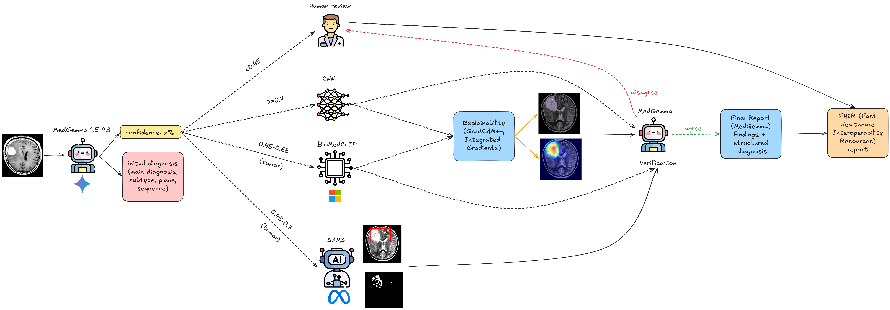

# Multi-Agent Neuroimaging Classifier

a LangGraph-based multi-agent pipeline for automated classification of neuroimaging findings (brain tumour, multiple sclerosis, stroke).

## Architecture


**Agents / tools**

| Component | Model | Role |
|---|---|---|
| `MedGemmaAgent` | google/medgemma-1.5-4b-it | Triage, bbox-guided diagnosis, verification, final report |
| `CNNClassifier` | VGG16 / DenseNet169 / ResNet101 | Task-specific classification |
| `SAM3Tool` | SAM3 frozen backbone + linear probe | Lesion segmentation (Dice = 0.836) |
| `BiomedCLIPTool` | microsoft/BiomedCLIP (ViT-B/16, layer 6) | Zero-shot re-ranking for ambiguous multiclass cases |
| `SiibraAtlasTool` | EBRAINS Julich-Brain v2.9 | Anatomical region assignment via MNI152 coordinates |

**Pipeline flow** (linear — every node runs for every image):

```
triage (MedGemma)
    → cnn_classify
    → sam3_segment
    → cnn_with_mask  (CNN on original + MedGemma on SAM3 overlay)
    → biomedclip
    → explainability  (Grad-CAM++ + Integrated Gradients)
    → verification    (MedGemma checks CNN vs saliency map)
    → report          (MedGemma fuses all outputs)
    → fhir_output
```

SAM3 and BiomedCLIP always run but contribute only when relevant: SAM3 segmentation is eligible only for `binary_tumor` and `multiclass_tumor` (the linear probe was trained on BraTS 2021; MS/stroke probes performed poorly). BiomedCLIP re-ranking is most meaningful for multiclass subtype disambiguation.

## Tasks

| Task | Best CNN | Accuracy |
|---|---|---|
| `binary_tumor` | VGG16 | 100.0% |
| `multiclass_tumor` | DenseNet169 | 99.0% |
| `stroke` | DenseNet169 | 97.7% |
| `ms` | ResNet101 | 59.7% |

## Project Structure

```
MultiAgentMedClassifier/
├── agents/
│   ├── medgemma_agent.py   # MedGemma: triage, bbox diagnosis, report
│   ├── cnn_tool.py         # CNN classifier (VGG16 / DenseNet / ResNet)
│   ├── sam3_tool.py        # SAM3 segmentation + linear probe head
│   ├── biomedclip_tool.py  # BiomedCLIP zero-shot / linear probe
│   └── sibra_tool.py       # EBRAINS siibra: lesion centroid → Julich-Brain region
├── pipeline/
│   ├── graph.py            # LangGraph StateGraph assembly
│   ├── nodes.py            # Node factory functions
│   ├── state.py            # NeuroimagingState TypedDict
│   └── fhir_output.py      # FHIR R4 DiagnosticReport serialiser
├── explainability/
│   ├── saliency.py         # GradCAM, GradCAM++, Integrated Gradients (used by pipeline)
│   ├── cnns.py             # Standalone CNN explainability experiment script (not imported by pipeline)
│   ├── multimodal.py       # Standalone CLIP/BiomedCLIP experiment script (not imported by pipeline)
│   └── uncertainty.py      # Standalone calibration experiment script (not imported by pipeline)
├── eval/
│   ├── evaluate.py         # Metrics: accuracy, F1, ECE, specificity, SAM3-rate, latency
│   └── tumor_eval.py       # Resumable JSONL eval for single tumor datasets (Figshare / Br35H)
├── prompts/
│   ├── system_prompt.txt       # MedGemma radiologist persona + JSON schema
│   └── system_prompt_bbox.txt  # Same schema, bbox-overlay context
├── tests/
│   └── test_atlas_enrichment.py  # Standalone test for atlas node on a single image
├── checkpoints/            # PyTorch state dicts: {arch}_{dataset}_final.pt
├── outputs/
│   ├── explainability/     # Saliency maps: gradcam_pp_*.png, ig_*.png
│   ├── segmentation/       # SAM3 binary masks (mask_*.png) and bbox overlays (guided_*.png)
│   ├── fhir/               # FHIR R4 bundles: fhir_<id>.json
│   └── eval/               # comparison_summary.csv, <task>_tumor_eval.jsonl
├── config.py               # Central config dataclasses
├── run_pipeline.py         # CLI entry point
└── requirements.txt
```

## Setup

```bash
python -m venv .venv
source .venv/bin/activate
pip install -r requirements.txt
```

**MedGemma** is a gated model — accept the terms of use at [hf.co/google/medgemma-1.5-4b-it](https://huggingface.co/google/medgemma-1.5-4b-it) then authenticate:

```bash
huggingface-cli login
# or
export HF_TOKEN=hf_...
```

**Hardware**: 16 GB VRAM recommended (RTX 5060 Ti or better). For <12 GB, enable 4-bit quantisation:

```python
# config.py
ModelConfig(use_4bit_quantization=True)
```

## CNN Checkpoints

Place the `_final.pt` checkpoints (plain state dicts) in `checkpoints/`:

```
checkpoints/
  vgg16_MRI_tumor_binary_norm_final.pt
  densenet169_MRI_tumor_multiclass_norm_final.pt
  resnet101_MRI_ms_norm_final.pt
  densenet169_CT_stroke_binary_norm_final.pt
  sam3_probe.pth
```

The pipeline selects the checkpoint automatically based on `--task`.

## Usage

**Single image (PNG/JPEG):**

```bash
python run_pipeline.py --image scan.png --task binary_tumor
```

**Single DICOM slice:**

```bash
python run_pipeline.py --image scan.dcm --task binary_tumor
```

**DICOM series directory:**

```bash
python run_pipeline.py --image /path/to/dicom_series --task binary_tumor
```
Raw DICOM inputs are converted to `outputs/preprocessed/*.png` before routing. For series inputs, the middle slice is selected as the representative 2D image and the chosen slice path is preserved in `metadata["dicom_path"]` for atlas enrichment.

**With explainability (Grad-CAM++ + Integrated Gradients):**

```bash
python run_pipeline.py --image scan.png --task binary_tumor --generate_explainability
```
Saliency maps are saved to `outputs/explainability/`.

**Full evaluation across all four datasets:**

```bash
python run_pipeline.py --eval \
  --binary_tumor_dir  data/test/binary_tumor \
  --multiclass_dir    data/test/multiclass_tumor \
  --ms_dir            data/test/ms \
  --stroke_dir        data/test/stroke
```
Results (accuracy, F1, ECE, normal specificity, SAM3-rate, latency) are saved to `outputs/eval/comparison_summary.csv`.

**Single-dataset tumor evaluation (resumable, all models, rich JSONL output):**

```bash
# Figshare 3-class (meningioma / glioma / pituitary)
python run_pipeline.py --tumor_eval \
  --tumor_eval_dir data/processed \
  --task multiclass_tumor \
  --label_map figshare3

# Br35H binary (tumor / normal)
python run_pipeline.py --tumor_eval \
  --tumor_eval_dir data/Br35H \
  --task binary_tumor \
  --label_map br35h

# Optional: cap total images (useful for quick tests or incremental runs)
  --max_samples 100
```
Writes one JSONL record per image to `outputs/eval/<task>_tumor_eval.jsonl` immediately after inference — crash-safe. Re-running the same command resumes from where it left off. Each record captures outputs from every model: MedGemma triage + final diagnosis, CNN class probabilities, SAM3 mask/bbox/dice, BiomedCLIP ranked scores, Grad-CAM++ and IG paths, SAM3/saliency IoU, verification result, and the full MedGemma report.

**With SAM3 segmentation enabled:**

```bash
python run_pipeline.py --image scan.png --task binary_tumor \
  --sam3_probe   checkpoints/sam3_probe.pth \
  --sam3_bpe_path sam3/sam3/assets/bpe_simple_vocab_16e6.txt.gz
```

**Force SAM3 on every non-normal case:**

```bash
python run_pipeline.py --image scan.png --task binary_tumor --always_run_sam3
```

**With few-shot examples for MedGemma triage:**

```bash
python run_pipeline.py --image scan.png --task binary_tumor \
  --few_shot --few_shot_data_dir /path/to/data
```
Prepends one real example image + expected JSON per class (tumor, stroke, multiple sclerosis, normal, other abnormalities) as prior conversation turns before the triage query. Examples are drawn from `few_shot_examples.csv`; missing images are skipped gracefully. `--few_shot_data_dir` is the root directory against which the CSV's relative image paths are resolved.

**Custom checkpoints / thresholds:**

```bash
python run_pipeline.py --image scan.png --task stroke \
  --cnn_stroke checkpoints/densenet169_stroke.pt \
  --sam3_threshold 0.65 \
  --human_threshold 0.40
```

## Report Output

The final report is a free-text triage summary generated by MedGemma, covering:

1. **Primary finding** — diagnosis name and subtype
2. **Confidence assessment** — routing confidence and tool agreement
3. **Recommended next step** — discharge, further imaging, or specialist referral
4. **Flags / caveats** — low-confidence warnings or human review triggers

The report is returned in `state["final_report"]` (plain text, ≤150 words). The pipeline also sets:

| Field | Description |
|---|---|
| `final_predicted_class` | CNN label (or BiomedCLIP top label if no CNN ran) |
| `final_confidence` | Confidence of the final prediction (may be capped by verification) |
| `requires_human_review` | `True` if confidence < `human_review_threshold` or MedGemma disagrees with CNN |
| `explainability_result` | Paths to `gradcam_pp_*.png` and `ig_*.png` (if enabled) |
| `verification_result` | MedGemma post-hoc agreement check against Grad-CAM++ saliency map (if explainability enabled) |
| `fhir_report` | FHIR R4 DiagnosticReport dict; saved to `outputs/fhir/fhir_<id>.json` |
| `atlas_enrichment` | EBRAINS atlas assignment: `assigned_region`, `hemisphere`, `mni_coords`, `assignment_scores` (only on `sam3_then_cnn` path) |

## Atlas Enrichment (EBRAINS / siibra)

On the `sam3_then_cnn` path, after SAM3 produces a binary mask, the pipeline runs an optional anatomical assignment step using [siibra-python](https://siibra-python.readthedocs.io) and the [EBRAINS Julich-Brain Cytoarchitectonic Atlas v2.9](https://search.kg.ebrains.eu).

The SAM3 mask centroid is mapped to MNI152 coordinates, which are then assigned to the nearest cytoarchitectonic region via a statistical probability map.

**Coordinate accuracy (best → worst):**

| Input | How it's used |
|---|---|
| `metadata["nifti_path"]` | NIfTI affine → exact MNI coords |
| `metadata["dicom_path"]` | `ImagePositionPatient` + `PixelSpacing` → scanner-space coords (≈ MNI for pre-registered datasets) |
| PNG only (default) | Pixel centroid normalised to MNI152 range; z locked to axial midplane (0 mm) |

Pass coordinate metadata at inference time:
```python
initial_state("scan.png", "binary_tumor", metadata={"nifti_path": "scan.nii.gz"})
```

If the main input itself is DICOM, `initial_state()` now injects `metadata["dicom_path"]` automatically after preprocessing the slice or series into a PNG.

**Test the node standalone (without running the full pipeline):**
```bash
python tests/test_atlas_enrichment.py --image data/scan.png --mask outputs/segmentation/mask_abc123.png
```

The `atlas_enrichment` result flows into the MedGemma report prompt and is serialised as an `ebrains-atlas-assignment` extension in the FHIR bundle.

**Note:** z=0.0 (axial midplane) is assumed when no NIfTI or DICOM is available. Region assignments are anatomically meaningful but spatially approximate. Scores are Julich-Brain probability map values; scores < 0.1 occur near region boundaries or at the midplane.

## Explainability Methods

| Method | Location | Notes |
|---|---|---|
| Grad-CAM | `saliency.py` | Baseline; criticised for uniform channel weights |
| Grad-CAM++ | `saliency.py` | Per-pixel α weights; sharper localisation |
| Integrated Gradients | `saliency.py` | Model-agnostic, satisfies Completeness axiom |

## Calibration

Post-hoc calibration is available via `eval/evaluate.py`:

```python
from eval.evaluate import TemperatureScaler, compute_ece

scaler = TemperatureScaler()
scaler.fit(val_logits, val_labels)          # optimises T via NLL
calibrated_probs = scaler.calibrate(test_logits)
ece = compute_ece(confidences, correct)     # binning-based ECE
```

## Prior Work

This pipeline builds on three prior thesis components:

- CNN benchmarking (VGG16 / DenseNet / ResNet on 4 datasets)
- BiomedCLIP layer-wise feature analysis (layer 6 of ViT-B/16 optimal across all four tasks)
- SAM3 linear probe segmentation (Dice = 0.836); SAM3→MedGemma pipeline improves tumour detection 85.1% → 96.3% but reduces specificity 67.1% → 41.3%; the agent routing in this work is designed to recover that specificity
