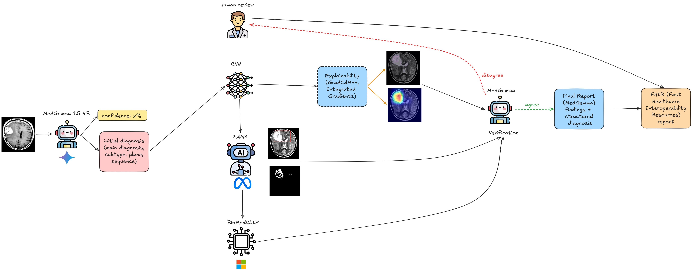

# Multi-Agent Neuroimaging Classifier

a LangGraph-based multi-agent pipeline for automated classification of neuroimaging findings (brain tumour, multiple sclerosis, stroke).

## Architecture


**Agents / tools**

| Component | Model | Role |
|---|---|---|
| `MedGemmaAgent` | google/medgemma-1.5-4b-it | Triage routing, bbox-guided diagnosis, final report |
| `CNNClassifier` | VGG16 / DenseNet169 / ResNet101 | Task-specific classification |
| `SAM3Tool` | SAM3 frozen backbone + linear probe | Lesion segmentation (Dice = 0.836) |
| `BiomedCLIPTool` | microsoft/BiomedCLIP (layer 18) | Zero-shot re-ranking for ambiguous multiclass cases |

**Routing logic** (derived from MedGemma `diagnosis_confidence`):

| Confidence | Route |
|---|---|
| ≥ 0.70 | `cnn_direct` |
| 0.65 – 0.70 (multiclass) | `biomedclip` |
| 0.45 – 0.70 | `sam3_then_cnn` |
| < 0.45 | `human_review` |

## Tasks

| Task | Best CNN | Accuracy |
|---|---|---|
| `binary_tumor` | VGG16 | 100.0% |
| `multiclass_tumor` | DenseNet169 | 99.0% |
| `stroke` | DenseNet169 | 97.7% |
| `ms` | ResNet101 | 59.7% |

## Project Structure

```
MultiAgentMedClassifier/
├── agents/
│   ├── medgemma_agent.py   # MedGemma: triage, bbox diagnosis, report
│   ├── cnn_tool.py         # CNN classifier (VGG16 / DenseNet / ResNet)
│   ├── sam3_tool.py        # SAM3 segmentation + linear probe head
│   └── biomedclip_tool.py  # BiomedCLIP zero-shot / linear probe
├── pipeline/
│   ├── graph.py            # LangGraph StateGraph assembly
│   ├── nodes.py            # Node factory functions
│   └── state.py            # NeuroimagingState TypedDict
├── explainability/
│   ├── saliency.py         # GradCAM, GradCAM++, Integrated Gradients (used by pipeline)
│   ├── cnns.py             # Standalone CNN explainability experiment script (not imported by pipeline)
│   ├── multimodal.py       # Standalone CLIP/BiomedCLIP experiment script (not imported by pipeline)
│   └── uncertainty.py      # Standalone calibration experiment script (not imported by pipeline)
├── eval/
│   └── evaluate.py         # Metrics: accuracy, F1, ECE, specificity, SAM3-rate, latency
├── prompts/
│   ├── system_prompt.txt       # MedGemma radiologist persona + JSON schema
│   └── system_prompt_bbox.txt  # Same schema, bbox-overlay context
├── checkpoints/            # PyTorch state dicts: {arch}_{dataset}_final.pt
├── outputs/
│   ├── explainability/     # Saliency maps: gradcam_pp_*.png, ig_*.png
│   └── eval/               # comparison_summary.csv
├── config.py               # Central config dataclasses
├── run_pipeline.py         # CLI entry point
└── requirements.txt
```

## Setup

```bash
python -m venv .venv
source .venv/bin/activate
pip install -r requirements.txt
```

**MedGemma** is a gated model — accept the terms of use at [hf.co/google/medgemma-1.5-4b-it](https://huggingface.co/google/medgemma-1.5-4b-it) then authenticate:

```bash
huggingface-cli login
# or
export HF_TOKEN=hf_...
```

**Hardware**: 16 GB VRAM recommended (RTX 5060 Ti or better). For <12 GB, enable 4-bit quantisation:

```python
# config.py
ModelConfig(use_4bit_quantization=True)
```

## CNN Checkpoints

Place the `_final.pt` checkpoints (plain state dicts) in `checkpoints/`:

```
checkpoints/
  vgg16_MRI_tumor_binary_norm_final.pt
  densenet169_MRI_tumor_multiclass_norm_final.pt
  resnet101_MRI_ms_norm_final.pt
  densenet169_CT_stroke_binary_norm_final.pt
  sam3_probe.pth
```

The pipeline selects the checkpoint automatically based on `--task`.

## Usage

**Single image:**

```bash
python run_pipeline.py --image scan.png --task binary_tumor
```

**With explainability (Grad-CAM++ + Integrated Gradients):**

```bash
python run_pipeline.py --image scan.png --task binary_tumor --generate_explainability
```
Saliency maps are saved to `outputs/explainability/`.

**Full evaluation across all four datasets:**

```bash
python run_pipeline.py --eval \
  --binary_tumor_dir  data/test/binary_tumor \
  --multiclass_dir    data/test/multiclass_tumor \
  --ms_dir            data/test/ms \
  --stroke_dir        data/test/stroke
```
Results (accuracy, F1, ECE, normal specificity, SAM3-rate, latency) are saved to `outputs/eval/comparison_summary.csv`.

**With SAM3 segmentation enabled:**

```bash
python run_pipeline.py --image scan.png --task binary_tumor \
  --sam3_probe   checkpoints/sam3_probe.pth \
  --sam3_bpe_path sam3/sam3/assets/bpe_simple_vocab_16e6.txt.gz
```

**Force SAM3 on every non-normal case:**

```bash
python run_pipeline.py --image scan.png --task binary_tumor --always_run_sam3
```

**Custom checkpoints / thresholds:**

```bash
python run_pipeline.py --image scan.png --task stroke \
  --cnn_stroke checkpoints/densenet169_stroke.pt \
  --sam3_threshold 0.65 \
  --human_threshold 0.40
```

## Report Output

The final report is a free-text triage summary generated by MedGemma, covering:

1. **Primary finding** — diagnosis name and subtype
2. **Confidence assessment** — routing confidence and tool agreement
3. **Recommended next step** — discharge, further imaging, or specialist referral
4. **Flags / caveats** — low-confidence warnings or human review triggers

The report is returned in `state["final_report"]` (plain text, ≤150 words). The pipeline also sets:

| Field | Description |
|---|---|
| `final_predicted_class` | CNN label (or BiomedCLIP top label if no CNN ran) |
| `final_confidence` | Confidence of the final prediction |
| `requires_human_review` | `True` if confidence < `human_review_threshold` |
| `explainability_result` | Paths to `gradcam_pp_*.png` and `ig_*.png` (if enabled) |

## Explainability Methods

| Method | Location | Notes |
|---|---|---|
| Grad-CAM | `saliency.py` | Baseline; criticised for uniform channel weights |
| Grad-CAM++ | `saliency.py` | Per-pixel α weights; sharper localisation |
| Integrated Gradients | `saliency.py` | Model-agnostic, satisfies Completeness axiom |

## Calibration

Post-hoc calibration is available via `eval/evaluate.py`:

```python
from eval.evaluate import TemperatureScaler, compute_ece

scaler = TemperatureScaler()
scaler.fit(val_logits, val_labels)          # optimises T via NLL
calibrated_probs = scaler.calibrate(test_logits)
ece = compute_ece(confidences, correct)     # binning-based ECE
```

## Prior Work

This pipeline builds on three prior thesis components:

- CNN benchmarking (VGG16 / DenseNet / ResNet on 4 datasets)
- BiomedCLIP layer-wise feature analysis (layer 18 optimal)
- SAM3 linear probe segmentation (Dice = 0.836); SAM3→MedGemma pipeline improves tumour detection 85.1% → 96.3% but reduces specificity 67.1% → 41.3%; the agent routing in this work is designed to recover that specificity
