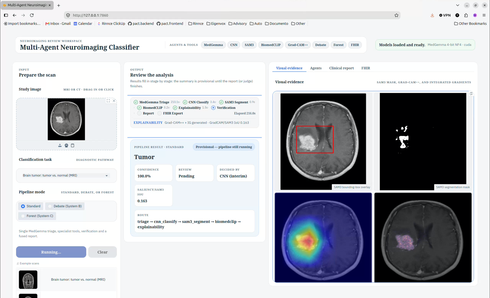
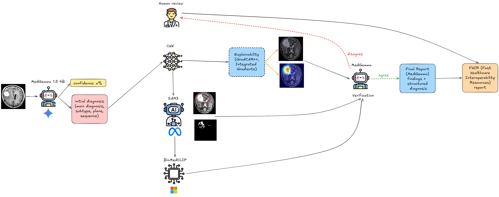

# Multi-Agent Neuroimaging Classifier

A LangGraph-based multi-agent pipeline for automated classification of neuroimaging findings (brain tumour, multiple sclerosis, stroke).

## Contents

- [Quick Start](#quick-start-gui)
- [Architecture](#architecture)
- [Tasks](#tasks)
- [Setup](#setup)
- [Checkpoints](#checkpoints)
- [Usage](#usage)
- [Report Output](#report-output)
- [Explainability Methods](#explainability-methods)
- [Calibration](#calibration)
- [Stage pipeline and MCP server](#stage-pipeline-and-mcp-server)
- [Prior Work](#prior-work)
- [Project Structure](#project-structure)

## Quick Start (GUI)

```bash
python -m venv .venv
source .venv/bin/activate
pip install -r requirements.txt     # see Setup for torch and SAM3

# Set your HuggingFace token (see Setup below)
cp .env.example .env
# edit .env and paste your HF_TOKEN

# Launch the web interface (add --load_4bit on GPUs < 12 GB)
python app.py
# Open http://localhost:7860 in a browser
```

Upload a brain scan (or click one of the example scans in `ui/examples/`), choose a task and a
pipeline mode (Standard, Debate or Forest), and click **Run Pipeline**. Results fill in stage by
stage: prediction, each agent's output, the clinical report, the SAM3 overlay, saliency maps and
the FHIR bundle. `app.py` accepts every `run_pipeline.py` config flag, and the UI always enables
explainability.



## Architecture



**Agents / tools**

| Component | Model | Role |
|---|---|---|
| `MedGemmaAgent` | google/medgemma-1.5-4b-it | Triage, bbox-guided diagnosis, verification, final report |
| `CNNClassifier` | VGG16 / DenseNet169 / ResNet101 | Task-specific classification |
| `SAM3Tool` | SAM3 frozen backbone + linear probe | Lesion segmentation (Dice = 0.836) |
| `BiomedCLIPTool` | microsoft/BiomedCLIP (ViT-B/16) | Linear probe on layer-6 features; falls back to zero-shot (final image embedding) when no probe checkpoint is available |

**Pipeline flow** (linear — every node runs for every image):

```
triage (MedGemma)
    → cnn_classify
    → sam3_segment
    → biomedclip
    → explainability  (Grad-CAM++ + Integrated Gradients)
    → verification    (MedGemma checks CNN vs saliency map)
    → report          (MedGemma fuses all outputs)
    → fhir_output
```

The explainability node (and with it the verification step and the Grad-CAM++/SAM3 IoU penalty)
only does work with `--generate_explainability`; without it the node is a no-op and verification
returns `None`.

SAM3 runs only for `binary_tumor` and `multiclass_tumor` — the linear probe was trained on BraTS 2020 and evaluated on BraTS 2021; MS/stroke probes performed poorly, so those tasks skip segmentation automatically. BiomedCLIP runs on all tasks but is most meaningful for multiclass subtype disambiguation.

## Tasks

| Task | Label space | Best CNN | CNN benchmark accuracy |
|---|---|---|---|
| `binary_tumor` | tumor / normal (MRI) | VGG16 | 100.0% |
| `multiclass_tumor` | 12 tumour types + normal head (MRI) | DenseNet169 | 99.0% |
| `stroke` | stroke / normal (CT) | DenseNet169 | 97.7% |
| `ms` | MS / normal (MRI) | ResNet101 | 59.7% |

Accuracies are from the prior CNN benchmark, each on its own test split. They do not carry over
to the evaluation datasets used here: on 3-class figshare the multiclass CNN scores 0.140
(0.271–0.314 with the softmax masked to the three figshare classes).

## Setup

Python 3.12 and a CUDA GPU. Install torch with the CUDA build that matches your driver first,
then the rest:

```bash
python -m venv .venv
source .venv/bin/activate
pip install torch torchvision --index-url https://download.pytorch.org/whl/cu126
pip install -r requirements.txt
```

`requirements.txt` gives version ranges. For an exact reproduction of the paper's runs use the
pinned `server_bundle/requirements-server.txt`.

**SAM3** is not on PyPI. Clone it into `./sam3` (the code adds it to `sys.path`), or install it
with `pip install --no-deps -e ./sam3`. Without it the pipeline runs and segmentation is skipped.

```bash
git clone https://github.com/facebookresearch/sam3
```

**MedGemma** is a gated model — accept the terms of use at [hf.co/google/medgemma-1.5-4b-it](https://huggingface.co/google/medgemma-1.5-4b-it) then authenticate:

```bash
# Option A - .env file (recommended)
cp .env.example .env          # copy the template
# open .env and set: HF_TOKEN=hf_your_token_here

# Option B - CLI login
huggingface-cli login

# Option C - environment variable
export HF_TOKEN=hf_...
```

**Hardware**: 16 GB VRAM recommended (RTX 5060 Ti or better). For <12 GB, enable 4-bit NF4
quantisation with `--load_4bit` (any entry point) or `MEDGEMMA_4BIT=1`.

## Checkpoints

Pretrained checkpoints (~800 MB total) are hosted on Hugging Face and **downloaded automatically** the first time each task runs — no extra steps needed:

```bash
python run_pipeline.py --image scan.png --task binary_tumor
# missing checkpoint is fetched to HF cache then copied to checkpoints/
```

| Repo | Task | Model |
|------|------|-------|
| [`tamara-kostova/multiagentmed-binary-tumor`](https://huggingface.co/tamara-kostova/multiagentmed-binary-tumor) | `binary_tumor` | VGG16 + BiomedCLIP probe |
| [`tamara-kostova/multiagentmed-multiclass-tumor`](https://huggingface.co/tamara-kostova/multiagentmed-multiclass-tumor) | `multiclass_tumor` | DenseNet169 + BiomedCLIP probe |
| [`tamara-kostova/multiagentmed-stroke`](https://huggingface.co/tamara-kostova/multiagentmed-stroke) | `stroke` | DenseNet169 + BiomedCLIP probe |
| [`tamara-kostova/multiagentmed-ms`](https://huggingface.co/tamara-kostova/multiagentmed-ms) | `ms` | ResNet101 + BiomedCLIP probe |
| [`tamara-kostova/multiagentmed-tumor-segmentation`](https://huggingface.co/tamara-kostova/multiagentmed-tumor-segmentation) | `binary_tumor`, `multiclass_tumor` | SAM3 linear probe (Dice = 0.836) |

<details>
<summary>Manual placement and local-only mode</summary>

The MCP server (`mcp_server.py`) checks and fetches all nine checkpoints at startup, so
starting it once is also a way to pre-download them.

**Manual placement** — place files directly in `checkpoints/`:

```
checkpoints/
  vgg16_MRI_tumor_binary_norm_final.pt
  densenet169_MRI_tumor_multiclass_norm_final.pt
  resnet101_MRI_ms_norm_final.pt
  densenet169_CT_stroke_binary_norm_final.pt
  linear_probe_BiomedCLIP_MRI_tumor_binary_norm_best.pt
  linear_probe_BiomedCLIP_MRI_tumor_multiclass_norm_best.pt
  linear_probe_BiomedCLIP_MRI_ms_norm_best.pt
  linear_probe_BiomedCLIP_CT_stroke_binary_norm_best.pt
  sam3_probe.pth
```

**Local-only mode** — disable all network access by adding to `.env`:

```bash
CHECKPOINT_SOURCE=local
```

Missing files fall back to ImageNet pretrained weights (CNN) or zero-shot mode (BiomedCLIP).
A CNN with ImageNet weights has an untrained head, so its predictions are meaningless; the
pipeline only prints a warning. Checkpoint paths are relative, so run from the repo root.

</details>

## Usage

**Single image:**

```bash
python run_pipeline.py --image scan.png --task binary_tumor
```

**With explainability (Grad-CAM++ + Integrated Gradients):**

```bash
python run_pipeline.py --image scan.png --task binary_tumor --generate_explainability
```

Saliency maps are saved to `outputs/explainability/`.

**Full evaluation across all four datasets:**

```bash
python run_pipeline.py --eval \
  --binary_tumor_dir  data/test/binary_tumor \
  --multiclass_dir    data/test/multiclass_tumor \
  --ms_dir            data/test/ms \
  --stroke_dir        data/test/stroke
```

Results (accuracy, F1, ECE, normal specificity, SAM3-rate, latency) for the agent pipeline are saved to `outputs/eval/comparison_summary.csv`.
This path scores differently from `eval/eval_analysis.py` (no strict binarisation), so its numbers
are not comparable to the paper tables; those come from the resumable JSONL path below.

**Single-dataset tumor evaluation (resumable, all models, rich JSONL output):**

```bash
# Figshare 3-class (meningioma / glioma / pituitary)
python run_pipeline.py --tumor_eval \
  --tumor_eval_dir data/processed \
  --task multiclass_tumor \
  --label_map figshare3

# Br35H binary (tumor / normal)
python run_pipeline.py --tumor_eval \
  --tumor_eval_dir data/Br35H \
  --task binary_tumor \
  --label_map br35h

# Optional: cap total images (useful for quick tests or incremental runs)
  --max_samples 100
```

Writes one JSONL record per image to `outputs/eval/<task>_tumor_eval.jsonl` immediately after inference — crash-safe. Re-running the same command resumes from where it left off. Each record captures outputs from every model: MedGemma triage + final diagnosis, CNN class probabilities, SAM3 mask/bbox/dice, BiomedCLIP ranked scores, Grad-CAM++ and IG paths, SAM3/saliency IoU, verification result, and the full MedGemma report.

**Single-dataset MS/stroke evaluation (resumable, 1000 images):**

```bash
python run_pipeline.py --dataset_eval \
  --dataset_eval_dir data/stroke/Brain_Stroke_CT_Dataset \
  --task stroke \
  --label_map stroke_binary \
  --max_samples 1000

python run_pipeline.py --dataset_eval \
  --dataset_eval_dir data/sclerosis/MS \
  --task ms \
  --label_map ms_binary \
  --max_samples 1000
```

The generic dataset evaluator scans `<dataset>/<class>/**/<image>` and writes to
`outputs/eval/<task>_dataset_eval.jsonl` by default.

**System B — Multi-Agent Debate** (CNN / BiomedCLIP / SAM3 MedGemma advocates + judge):

```bash
# Single-round arbitration (default)
python run_pipeline.py --image scan.png --task multiclass_tumor --pipeline_mode debate

# Two debate rounds: advocates respond to the round-1 verdict
python run_pipeline.py --image scan.png --task multiclass_tumor --pipeline_mode debate --debate_rounds 2

# Research sweep over 1 / 2 / 3 rounds (whole family)
python run_research.py --family debate_rounds --multiclass_dir data/figshare

# Or a single config on a class-balanced subset, for a quick run
python run_research.py --family debate_rounds --points debate_r2 --max_samples 200 \
  --multiclass_dir data/figshare
```

The sweep writes `outputs/research/debate_rounds_<timestamp>/analysis/report.md`, which
includes a **Debate Round Analysis** table (verdict stability vs. ECE). Labels are
canonicalized automatically, so raw class-folder datasets score correctly.

Debate replaces the `verification + report` tail. Three MedGemma instances argue on behalf of CNN, BiomedCLIP, and SAM3 outputs respectively; a fourth MedGemma instance judges. In round 2+, advocates see the prior verdict and the other advocates' arguments before responding. Verdict stored in `state["debate_verdict"]`; per-round arguments in `state["debate_arguments"]`.

**System C — Agent Forest** (N role-specialized MedGemma agents + majority vote):

```bash
# 3-agent forest (radiologist, conservative, emergency roles)
python run_pipeline.py --image scan.png --task multiclass_tumor --pipeline_mode forest

# 4-agent forest (adds differential-diagnostician role)
python run_pipeline.py --image scan.png --task multiclass_tumor --pipeline_mode forest --forest_n_agents 4

# Research sweep over N = 1 / 3 / 4 agents (whole family)
python run_research.py --family agent_forest --multiclass_dir data/figshare

# Or a single size on a class-balanced subset
python run_research.py --family agent_forest --points forest_n4 --max_samples 200 \
  --multiclass_dir data/figshare
```

The sweep report includes a **Forest Voting Quality** table (dissent rate vs. accuracy).
`forest_n1` is the single-agent baseline (`radiologist` only, no vote) used as the
control for the N-comparison.

Forest replaces the single `triage` node. N role-specialized MedGemma instances (prompts in `prompts/forest_*.txt`) independently diagnose the scan; majority vote + confidence-weighted tiebreaking produces the consensus routing decision. All downstream nodes (CNN, SAM3, BiomedCLIP, report) run unchanged. Votes stored in `state["forest_votes"]`; consensus in `state["forest_consensus"]` (includes `dissent_rate` and `vote_fraction`).

### Running these on a shared GPU server (`server_bundle/`)

The Forest/Debate runs below were executed on a GPU server and packaged as a self-contained hand-off in
[`server_bundle/`](server_bundle/): a Singularity definition (`container.def`, CUDA 12.6 /
Python 3.12 / torch 2.10+cu126, versions pinned to the environment that produced the
existing JSONLs), numbered one-command step scripts, a preflight that proves both pipelines
run before a night of GPU time is committed, and TSV/CSV export of every result.

```bash
# locally, once
python server_bundle/scripts/prepack_models.py     # build offline hf_cache/ (~12.5 GB)
bash   server_bundle/scripts/pack_bundle.sh        # → maclf-code-data.tar.gz + maclf-models.tar

# on the server (see server_bundle/README_SERVER.md)
singularity build --remote container.sif container.def
bash server_bundle/00_preflight.sh                 # must print PREFLIGHT OK
nohup bash server_bundle/run_all.sh &              # or run_parallel.sh 0 1 2
bash server_bundle/90_export_results.sh            # → results_<host>_<date>.tar.gz
```

`server_bundle/PLAN.md` holds the campaign plan and the measured facts behind it.

### Guide — reproducing paper-comparable Forest / Debate results

These runs use the **resumable rich-JSONL eval path** — the same path the paper's tables
came from. It is crash-safe (re-run the exact command to continue), applies label
canonicalization, samples class-balanced up to `--max_samples`, and honours
`--pipeline_mode`.

The dataset directories below are the ones actually recorded in the `image_path` field of
the completed runs in `outputs/eval/`, so they are the paths the results were produced
from:

| Task | `--*_eval_dir` | Class folders |
|---|---|---|
| `binary_tumor` | `data/Br35H` | `yes`, `no` |
| `multiclass_tumor` | `data/figshare` | `1`, `2`, `3` |
| `ms` | `data/sclerosis/MS` | `MS Axial_crop`, `MS Saggital_crop`, `Control Axial_crop`, `Control Saggital_crop` |
| `stroke` | `data/stroke/Brain_Stroke_CT_Dataset` | `Bleeding/PNG`, `Ischemia/PNG`, `Normal/PNG` |

The stroke `OVERLAY/` folders have the lesion painted on and are excluded by
`_DEFAULT_EXCLUDE_DIRS` in `eval/tumor_eval.py`. An earlier stroke baseline read them (label
leakage); it is kept only as `outputs/eval/stroke_dataset_eval.jsonl.bak` and must not be used.

Note that `data/processed` is a *separate* copy of the figshare data that no paper run
used — point `multiclass_tumor` at `data/figshare` to stay comparable to the existing
JSONLs. Stroke images sit one level below the class folder, which is fine here because
`run_dataset_eval` globs recursively; `load_test_split` (used by `run_research.py`) does
not, so the sweep path needs a directory whose class folders hold images directly.

`--max_samples 500` samples class-balanced up to that cap (binary 250/250, multiclass
167/167/166, MS 125×4, stroke 167/167/166).

**Status.** All eight runs are complete (n=500 each) and live in `outputs/eval/`:
`{binary,multiclass,stroke,ms}_forest_n4.jsonl` and `{binary,multiclass,stroke,ms}_debate_r2.jsonl`.
The commands below are the recipe to reproduce them. Measured cost: Forest N=4 took 8.9–9.6 h
per 500 images; Debate R=2 is roughly 1.5–2× that (9 image-conditioned MedGemma calls vs 7).

On `multiclass_tumor` the CNN has a 12-class head evaluated on 3-class figshare (accuracy
0.140, and 0.271–0.314 after masking the softmax to the three figshare classes) and BiomedCLIP
scores 0.163, so both tool advocates the debate judge arbitrates between are at or below chance.

**0. Smoke test** — 10 images, MS, capped. Because resume keys on the output file, re-running
step 5's command later continues from image 11 rather than restarting:

```bash
python run_pipeline.py --dataset_eval --task ms     --label_map ms_binary \
  --dataset_eval_dir data/sclerosis/MS                 --max_samples 10 \
  --pipeline_mode debate --debate_rounds 2 \
  --dataset_eval_output outputs/eval/ms_debate_r2.jsonl
```

Check `error` is null and that `debate_rounds_completed`, `debate_round_changed` and
`debate_winner` are populated, then read the median `latency_s` to project the full run. If
it exceeds ~100 s/image, drop the debate runs to `--max_samples 300` so each fits one night.

**1–2. Forest N=4 — `stroke` then `ms`:**

```bash
python run_pipeline.py --dataset_eval --task stroke --label_map stroke_binary \
  --dataset_eval_dir data/stroke/Brain_Stroke_CT_Dataset --max_samples 500 \
  --pipeline_mode forest --forest_n_agents 4 \
  --dataset_eval_output outputs/eval/stroke_forest_n4.jsonl

python run_pipeline.py --dataset_eval --task ms     --label_map ms_binary \
  --dataset_eval_dir data/sclerosis/MS                 --max_samples 500 \
  --pipeline_mode forest --forest_n_agents 4 \
  --dataset_eval_output outputs/eval/ms_forest_n4.jsonl
```

Tumour tasks:

```bash
python run_pipeline.py --tumor_eval   --task binary_tumor     --label_map br35h \
  --tumor_eval_dir   data/Br35H                        --max_samples 500 \
  --pipeline_mode forest --forest_n_agents 4 \
  --tumor_eval_output   outputs/eval/binary_forest_n4.jsonl

python run_pipeline.py --tumor_eval   --task multiclass_tumor --label_map figshare3 \
  --tumor_eval_dir   data/figshare                     --max_samples 500 \
  --pipeline_mode forest --forest_n_agents 4 \
  --tumor_eval_output   outputs/eval/multiclass_forest_n4.jsonl
```

**3–6. Debate R=2 — `binary_tumor`, `stroke`, `ms`, `multiclass_tumor`:** identical to the
Forest commands with `--pipeline_mode debate --debate_rounds 2` and `*_debate_r2.jsonl`
output names:

```bash
python run_pipeline.py --tumor_eval   --task binary_tumor     --label_map br35h \
  --tumor_eval_dir   data/Br35H                        --max_samples 500 \
  --pipeline_mode debate --debate_rounds 2 \
  --tumor_eval_output   outputs/eval/binary_debate_r2.jsonl

python run_pipeline.py --dataset_eval --task stroke --label_map stroke_binary \
  --dataset_eval_dir data/stroke/Brain_Stroke_CT_Dataset --max_samples 500 \
  --pipeline_mode debate --debate_rounds 2 \
  --dataset_eval_output outputs/eval/stroke_debate_r2.jsonl

python run_pipeline.py --dataset_eval --task ms     --label_map ms_binary \
  --dataset_eval_dir data/sclerosis/MS                 --max_samples 500 \
  --pipeline_mode debate --debate_rounds 2 \
  --dataset_eval_output outputs/eval/ms_debate_r2.jsonl

python run_pipeline.py --tumor_eval   --task multiclass_tumor --label_map figshare3 \
  --tumor_eval_dir   data/figshare                     --max_samples 500 \
  --pipeline_mode debate --debate_rounds 2 \
  --tumor_eval_output   outputs/eval/multiclass_debate_r2.jsonl
```

**Then build the metric tables** (Acc / F1 / Sens / Spec) from each JSONL, exactly as for
the paper — compare each against the matching baseline JSONL already in `outputs/eval/`:

```bash
python eval/eval_analysis.py --jsonl outputs/eval/multiclass_forest_n4.jsonl
python eval/eval_analysis.py --jsonl outputs/eval/multiclass_tumor_tumor_eval.jsonl  # baseline
```

**Scoring convention.** On binary tasks, `--scoring` selects how a prediction naming a
*different* pathology is counted, and the choice moves the numbers substantially, so state
it alongside any reported result. `strict` (the default) answers the task's own question —
"is this stroke?" — so naming another pathology is an assertion that the target pathology is
absent and scores as a negative. `abnormal` answers "is this scan not-normal?", counting any
pathology label as positive, which inflates sensitivity and deflates specificity whenever
the model names an off-task pathology. This matters here because MedGemma frequently does:
23.5% of MS scans are labelled `glioma` and 13.7% of stroke CTs are labelled with a tumour
subtype. Both conventions are written to `model_accuracy_summary.csv` (columns
`accuracy`/`sensitivity`/`specificity` for the selected mode, plus `*_abnormal` for the
other) together with `n_abstained`, so a reader can see how much of a number is the scoring
choice rather than model behaviour. Multiclass tumour is unaffected — it is always scored on
the canonical subtype.

```bash
python eval/eval_analysis.py --jsonl outputs/eval/ms_debate_r2.jsonl --scoring abnormal
```

The forest/debate JSONLs also carry the per-sample voting/verdict fields, so the **same**
`eval_analysis.py` run additionally prints (and saves) the *Agent Forest — voting quality*
table for forest JSONLs and the *Multi-Agent Debate — round analysis* table for debate
JSONLs. No separate run is needed for those.

**Notes**

- **Resumable & crash-safe** — Forest N=4 and Debate R=2 add several MedGemma calls per
  image, so each 500-image task is multi-hour and all eight together are a multi-day
  campaign. Re-run any command to continue from where it stopped.
- **Use the distinct `--*_output` names above — never the defaults.** Resume keys on the
  output file, and the default names (`multiclass_tumor_tumor_eval.jsonl`, etc.) already
  hold the **standard-pipeline baseline** results; reusing them would append forest/debate
  rows into (and corrupt) the paper's baseline files.
- **`--max_samples 500` samples class-balanced** on these directories. Drop it to run the
  full datasets. The tumour and MS baseline JSONLs in `outputs/eval/` were run at
  `--max_samples 1000`, so compare them on the Forest/Debate image set only
  (`eval/paired_system_comparison.py` does this). The stroke baseline was re-run on exactly
  the 500 Forest/Debate images.
- **Do not add `--skip_report` for forest** — the report node produces the forest's final
  prediction, and without it the final class falls back to the CNN. (Debate replaces the
  report node, so it doesn't apply there.)
- **Verification and the IoU penalty need `--generate_explainability`.** The commands above
  (and `server_bundle/`) do not pass it, so those runs have no verification result and no
  Grad-CAM++/SAM3 IoU.
- **SAM3** contributes only to the tumour tasks, and only if `checkpoints/sam3_probe.pth`
  is present on the machine.
- The **dissent-rate / verdict-stability tables** are produced from these same JSONLs by
  `eval/eval_analysis.py` (above) — no extra run. `run_research.py` remains an alternative
  that renders them into a combined sweep report if you also want that format.

**Force SAM3 routing intent on every non-normal case** (overrides the confidence-based routing decision recorded in state):

```bash
python run_pipeline.py --image scan.png --task binary_tumor --always_run_sam3
```

**With few-shot examples for MedGemma triage:**

```bash
python run_pipeline.py --image scan.png --task binary_tumor \
  --few_shot --few_shot_data_dir /path/to/data
```

Prepends task-relevant real example images + expected JSON as prior conversation turns before the triage query. Examples are drawn from `few_shot_examples.csv`; missing images are skipped gracefully.

Few-shot evaluation uses separate default output files so it does not resume from
zero-shot runs:

```bash
python run_pipeline.py --dataset_eval \
  --dataset_eval_dir data/stroke/Brain_Stroke_CT_Dataset \
  --task stroke \
  --label_map stroke_binary \
  --max_samples 1000 \
  --few_shot --few_shot_data_dir data

python run_pipeline.py --dataset_eval \
  --dataset_eval_dir data/sclerosis/MS \
  --task ms \
  --label_map ms_binary \
  --max_samples 1000 \
  --few_shot --few_shot_data_dir data
```

Defaults: `outputs/eval/<task>_few_shot_dataset_eval.jsonl` for `--dataset_eval`
and `outputs/eval/<task>_few_shot_tumor_eval.jsonl` for `--tumor_eval`.
For tumor few-shot, rerun the same `--tumor_eval` commands and add
`--few_shot --few_shot_data_dir data`.

**Custom checkpoints / thresholds:**

```bash
python run_pipeline.py --image scan.png --task stroke \
  --cnn_stroke checkpoints/densenet169_CT_stroke_binary_norm_final.pt \
  --sam3_threshold 0.65 \
  --human_threshold 0.40
```

Other checkpoint flags: `--cnn_binary_tumor`, `--cnn_multiclass`, `--cnn_ms`.

## Report Output

The final report is a free-text triage summary generated by MedGemma, covering:

1. **Primary finding** — diagnosis name and subtype
2. **Confidence assessment** — routing confidence and tool agreement
3. **Recommended next step** — discharge, further imaging, or specialist referral
4. **Flags / caveats** — low-confidence warnings or human review triggers

The report is returned in `state["final_report"]` (plain text, ≤150 words). The pipeline also sets:

| Field | Description |
|---|---|
| `final_predicted_class` | MedGemma's fused report diagnosis (`diagnosis_detailed` on `multiclass_tumor`, `diagnosis_name` otherwise); falls back to the CNN, then BiomedCLIP, then triage when the report has none. Debate: the judge's verdict. |
| `final_confidence` | Confidence of the final prediction, scaled down when the Grad-CAM++/SAM3 IoU is below `low_iou_penalty_threshold` (0.30) |
| `requires_human_review` | `True` if the final confidence < `human_review_threshold` (0.45), the Grad-CAM++/SAM3 IoU < 0.30, verification disagrees with the CNN, or the report could not be parsed |
| `explainability_result` | Paths to `gradcam_pp_*.png` and `ig_*.png` (if enabled) |
| `verification_result` | MedGemma post-hoc agreement check against the Grad-CAM++ saliency map (if explainability enabled) |
| `fhir_report` | FHIR R4 DiagnosticReport dict; saved to `outputs/fhir/fhir_<id>.json`. Status is `preliminary` when `requires_human_review`, else `final`. |

On disagreement, `verification_node` caps the confidence at 0.55 and sets
`requires_human_review`, and the report keeps both. The IoU penalty never scales confidence
below half (`low_iou_penalty_floor`).

## Explainability Methods

| Method | Location | Notes |
|---|---|---|
| Grad-CAM | `explainability/saliency.py` | Baseline; criticised for uniform channel weights |
| Grad-CAM++ | `explainability/saliency.py` | Per-pixel α weights; sharper localisation (used by the pipeline) |
| Integrated Gradients | `explainability/saliency.py` | Model-agnostic, satisfies Completeness axiom (used by the pipeline) |

## Calibration

Post-hoc temperature scaling is available via `eval/evaluate.py`:

```python
from eval.evaluate import TemperatureScaler, compute_ece

scaler = TemperatureScaler()
scaler.fit(val_logits, val_labels)          # optimises T via NLL
calibrated_probs = scaler.calibrate(test_logits)
ece = compute_ece(confidences, correct)     # binning-based ECE
```

Fitted temperatures go in `config.py:ModelConfig.cnn_temperatures` or are loaded at runtime
with `--calibration_file temps.json`. The default is T=1.0 (no calibration).

## Stage pipeline and MCP server

A config-driven version of the same agents runs as an ordered list of stages
(`configs/pipelines/{standard,forest,debate}.yaml`), including slice extraction from 3D volumes,
CNN screening of every slice and study-level aggregation:

```bash
python run_stages.py --config configs/pipelines/standard.yaml --task binary_tumor --image scan.png
python run_stages.py --config configs/pipelines/standard.yaml --task stroke --volume vol.npy --modality CT
python run_stages.py --list_stages
```

`mcp_server.py` exposes it as MCP tools (`classify`, `classify_slices`, `classify_volume`,
`list_capabilities`) over Streamable HTTP or stdio:

```bash
NEURO_MCP_TOKEN=... python mcp_server.py --host 0.0.0.0 --port 8765 --load_4bit
python mcp_client.py --stdio --task binary_tumor --images scan.png -- --load_4bit   # smoke test
```

The Docker image (`Dockerfile`, published as `tamarakostova/neuro-mcp`) and the `classify`
input/output contract are documented in [`docker/README.md`](docker/README.md). The paper's
numbers all come from the LangGraph path above, not from the stage pipeline.

## Prior Work

This pipeline builds on three prior thesis components:

- CNN benchmarking (VGG16 / DenseNet / ResNet on 4 datasets)
- BiomedCLIP layer-wise feature analysis (layer 6 of ViT-B/16 optimal across all four tasks)
- SAM3 linear probe segmentation (Dice = 0.836); SAM3→MedGemma pipeline improves tumour detection 85.1% → 96.3% but reduces specificity 67.1% → 41.3%; the agent routing in this work is designed to recover that specificity

## Project Structure

```
MultiAgentMedClassifier/
├── agents/
│   ├── medgemma_agent.py   # MedGemma: triage, report, verification, debate judge/advocate, forest role
│   ├── cnn_tool.py         # CNN classifier (VGG16 / DenseNet / ResNet)
│   ├── sam3_tool.py        # SAM3 segmentation + linear probe head
│   ├── biomedclip_tool.py  # BiomedCLIP linear probe / zero-shot
│   ├── debate.py           # System B: DebateOrchestrator (3 advocates + judge, 1–3 rounds)
│   ├── forest.py           # System C: AgentForest (4 roles, majority vote)
│   └── few_shot_loader.py  # Few-shot examples for triage (few_shot_examples.csv)
├── pipeline/
│   ├── graph.py            # LangGraph assembly: standard / debate / forest
│   ├── nodes.py            # Node factory functions
│   ├── state.py            # NeuroimagingState TypedDict
│   ├── fhir_output.py      # FHIR R4 bundle serialiser
│   ├── stages/             # Stage pipeline (slice extraction, screening, agents, aggregation)
│   ├── registry.py, runner.py, resources.py, context.py   # stage registry and runner
├── configs/pipelines/      # Stage pipeline YAMLs (standard / forest / debate)
├── explainability/
│   ├── saliency.py         # Grad-CAM, Grad-CAM++, Integrated Gradients (used by pipeline)
│   └── uncertainty.py      # Standalone calibration experiment script
├── eval/
│   ├── tumor_eval.py               # Resumable JSONL eval (--tumor_eval / --dataset_eval)
│   ├── eval_analysis.py            # Per-system tables from a JSONL (paper numbers)
│   ├── paired_system_comparison.py # Base vs Forest vs Debate: McNemar + Holm, Wilson CIs
│   ├── evaluate.py                 # --eval / sweep metrics, TemperatureScaler, ECE
│   ├── judge_attribution.py, backfill_labels.py, plot_analysis.py
│   └── tumor_eval_analysis.py, report_analysis.py   # older analysis scripts
├── experiments/            # Research sweep orchestrator (run_research.py)
├── prompts/                # MedGemma system prompts (JSON schema) and forest role prompts
├── ui/
│   ├── demo.py             # Gradio UI (launched by app.py)
│   ├── styles/app.css
│   └── examples/<task>/    # Example scans shown in the UI
├── server_bundle/          # Faculty GPU server hand-off (Singularity, step scripts, PLAN.md)
├── docker/                 # MCP image docs and pinned requirements (Dockerfile at repo root)
├── checkpoints/            # Weights (auto-downloaded) + upload_*.py scripts for the HF repos
├── utils/convert.py        # figshare .mat -> PNG conversion
├── outputs/                # segmentation/, explainability/, fhir/, eval/, analysis/
├── app.py                  # Gradio entry point (python app.py → http://localhost:7860)
├── run_pipeline.py         # CLI: single image, --eval, --tumor_eval, --dataset_eval
├── run_research.py         # CLI: research sweeps
├── run_stages.py           # CLI: stage pipeline
├── mcp_server.py, mcp_client.py   # MCP endpoint and reference client
├── config.py               # Central config dataclasses
├── Dockerfile, .dockerignore
├── .env.example            # Copy to .env and fill in HF_TOKEN
└── requirements.txt
```

